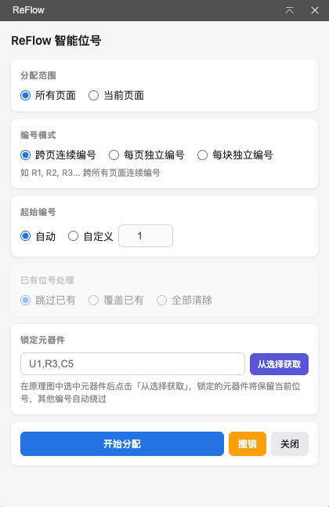
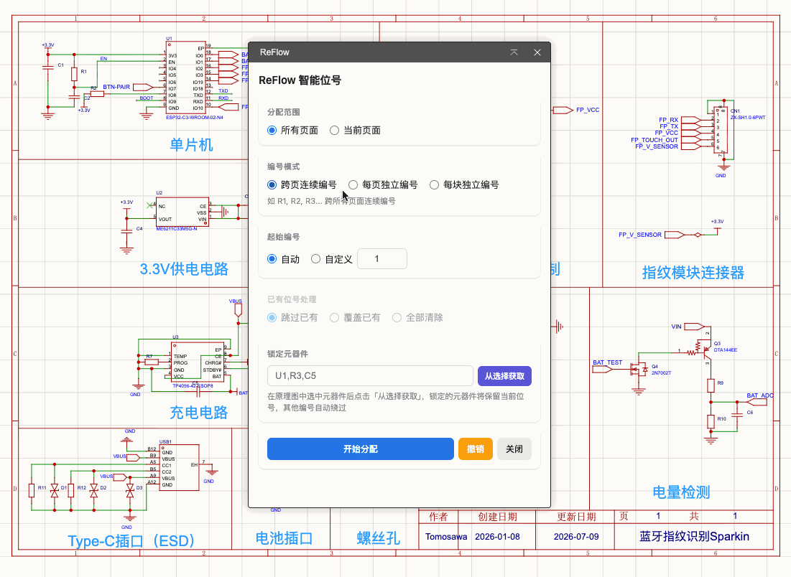

[简体中文](./README.md) | [English](./README.en.md) | [繁體中文](./README.zh-Hant.md) | [日本語](#) | [Русский](./README.ru.md)

# ReFlow スマートデザインネータ

JLCEDA / EasyEDA Pro 向け スマートリファレンスデザインネータ再割り当て拡張

## 概要

**ReFlow スマートデザインネータ** は回路の論理構造を理解し、電気的に接続されたコンポーネントを機能モジュール（クラスター）として自動識別し、各クラスター内のコンポーネントに連続したリファレンスデザインネータを割り当てます。

従来の順次採番では、関連するコンポーネントの番号が離散してしまいます。ReFlow は Union-Find アルゴリズムで配線接続性を解析し、同じ機能ブロックに属するコンポーネントに連番（R/C/U など）を割り当て、回路図の可読性と保守性を大幅に向上させます。

## 機能デモ

## 機能

### 3つの採番モード

| モード | 例 | 説明 |
|--------|-----|------|
| 連続採番 | R1, R2, R3... | 全ページにわたり連続採番 |
| ページ別採番 | R101, R201 | R101=1ページ目R01、R201=2ページ目R01 |
| ブロック別採番 | R101, R201 | R101=ブロック1 R01、R201=ブロック2 R01、接続モジュール別 |

### スコープ

- **全ページ** — P1からページ順に割り当て（デフォルト）
- **現在のページ** — 開いているページのみ再割り当て

### 開始番号

- **自動** — 全ページモードでは1から、現在のページモードでは既存の最大番号+1から
- **カスタム** — 開始番号を指定

### 既存デザインネータの処理（現在のページモード）

- **スキップ** — 他のページで使用済みの番号を自動スキップ（デフォルト）
- **上書き** — 強制的に割り当て、他のページの重複番号を未割り当てに
- **全クリア** — 他のページを考慮せず割り当て

### コンポーネントのロック

入力または「選択から取得」ボタンで、デザインネータを保持するコンポーネントを指定。他の番号は自動的に回避します。

### その他

- **元に戻す** — ワンクリックで割り当て前の状態に復元
- **多言語** — 中文 / English インターフェース切替対応
- **リアルタイムログ** — 割り当て進捗とデザインネータ変更レポートを表示

## 使い方

1. 回路図ページを開く
2. メニュー → **ReFlow スマートデザインネータ** → **再割り当て...**
3. UIで採番モードと処理オプションを選択
4. 「開始」をクリック

## ライセンス

[Apache License 2.0](https://choosealicense.com/licenses/apache-2.0/)
